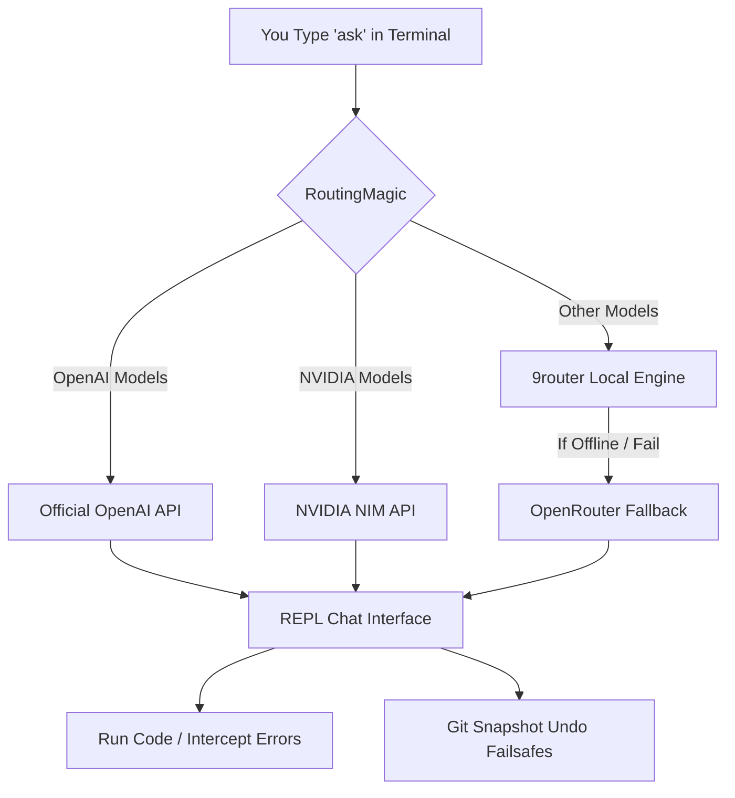

# RoutingMagic 🪄

**Your Smart AI Assistant & Codebase Router**

---

## 📖 The User Story
Imagine you're building a massive application. You need an AI assistant, but pasting hundreds of files into ChatGPT is exhausting, and giving an AI terminal access can be dangerous if it writes bad code. 

**RoutingMagic** solves this. It sits in your Mac's terminal and automatically knows what folder you are in. When you type `ask`, it instantly acts as your pair programmer. If an AI model gets too expensive, RoutingMagic automatically switches to a free model. If the AI breaks your code, RoutingMagic has a built-in "Undo" button to instantly fix it. It even automatically writes your project documentation for you!

---

## 🏗️ Architecture Flow



---

## 📦 Step-by-Step Installation

### Step 1: Install & Start 9router
RoutingMagic relies on **9router** to securely route requests locally before hitting the cloud. 
1. Open your terminal.
2. Install and start 9router so it runs in the background (it binds to port `20128` by default).

### Step 2: Clone RoutingMagic
Download the RoutingMagic tool to your computer:
```bash
git clone https://github.com/prakharmishra2026/RoutingMagic.git ~/Projects/RoutingMagic
cd ~/Projects/RoutingMagic
```

### Step 3: Run the Installer
Run the installation script to globally register the shortcuts on your computer:
```bash
./install.sh
source ~/.zshrc
```

### Step 4: Add Your API Keys
No need to configure keys for every single project:
1. Open `~/global.env` on your computer.
2. Add your AI provider keys (e.g., `NVIDIA_API_KEY`, `OPENROUTER_API_KEY`, `OPENAI_API_KEY`).
*RoutingMagic will automatically merge these global keys with any specific `.env` keys in your project folders!*

---

## 🚀 Global Terminal Commands (Use anywhere)

You can run these commands from **any** folder or project on your computer using your standard Mac terminal, VS Code terminal, or Antigravity IDE terminal.

### 1. `ask "your question"`
This is your fast, daily assistant. Type `ask` followed by what you want to know. 
*   **Example:** `ask "How do I connect to Supabase?"`
*   **How it works:** It instantly sniffs out the folder you are in, detects your project stack, and gets you a contextual answer in milliseconds.
*   **Interactive Chat:** Type `ask` with nothing after it to enter a continuous chat room (REPL).

### 2. `ask deep "your question"`
Use this for big architectural questions when you want the AI to understand your entire project.
*   **Example:** `ask deep "Is my mutual funds page effective?"`
*   **How it works:** It looks for your core project status files (`memory.md`, `progress.md`, `scratchpad.md`, `lessons.md`). If they are there, it reads them instantly (saving you tokens). If not, it does a full scan of your project files.

### 3. `save` (Intelligent Codebase Auto-Saver)
This command keeps your project documentation up-to-date automatically using AI.
*   **Example:** Just type `save` in your project folder.
*   **How it works:** It reads your recent code changes and generates a **plain English, color-coded summary** (Grill Me Diff). It will present this summary and ask for your approval before updating your 4 core developer files (`memory.md`, `progress.md`, `scratchpad.md`, `lessons.md`).
*   **Pro-tip:** Type `save --auto` to skip the approval process if you trust the AI.

### 4. `cc-route "your task"`
Routes your task to the best Claude Code model configuration.
*   **Example:** `cc-route "fix the auth bug on production"` (automatically routes to paid Sonnet 4.6 because it's critical production work).

---

## 🛠️ Interactive REPL Commands (Inside `ask`)

When you type `ask` and enter the interactive chat room, you unlock powerful specialized commands. Type these directly into the chat:

### 🧠 Model & Cost Management
*   `/model` - Opens a dropdown menu to instantly switch between available free and paid models (e.g. GLM-5.1, DeepSeek, o3-mini).
*   `/cost` - Shows you how many requests you've used today, your RPM (Requests Per Minute) limits for free models, and tracks your $5 budget cap for paid models.

### 🛡️ Code Failsafes (Undo Button)
*   `/safe` - Creates an instant, silent Git snapshot of your codebase. Always run this before asking the AI to write complex code!
*   `/restore` - If the AI breaks your code, run this to instantly "Undo" and revert your project back to exactly how it was when you ran `/safe`.

### 📂 Agent Workspaces & Memory
*   `/workspace [name]` - (e.g., `/workspace frontend`) Creates an isolated memory context. Your frontend and backend chats will no longer pollute each other's windows.
*   `/pin [filename]` - Permanently locks a critical file into the system's memory so the AI never forgets it, no matter how long the conversation goes.

### 🐛 Smart Error Interception & Testing
*   `! [command]` or `/run [command]` - Run any normal terminal command (e.g., `! npm start`). If the command crashes, the system intercepts the red error text and asks if you want the LLM to automatically fix the bug.
*   `/test [command]` - Run a background test (e.g., `/test pytest`). If the test fails, it skips the prompt and immediately feeds the error log to the LLM to auto-correct the code.
