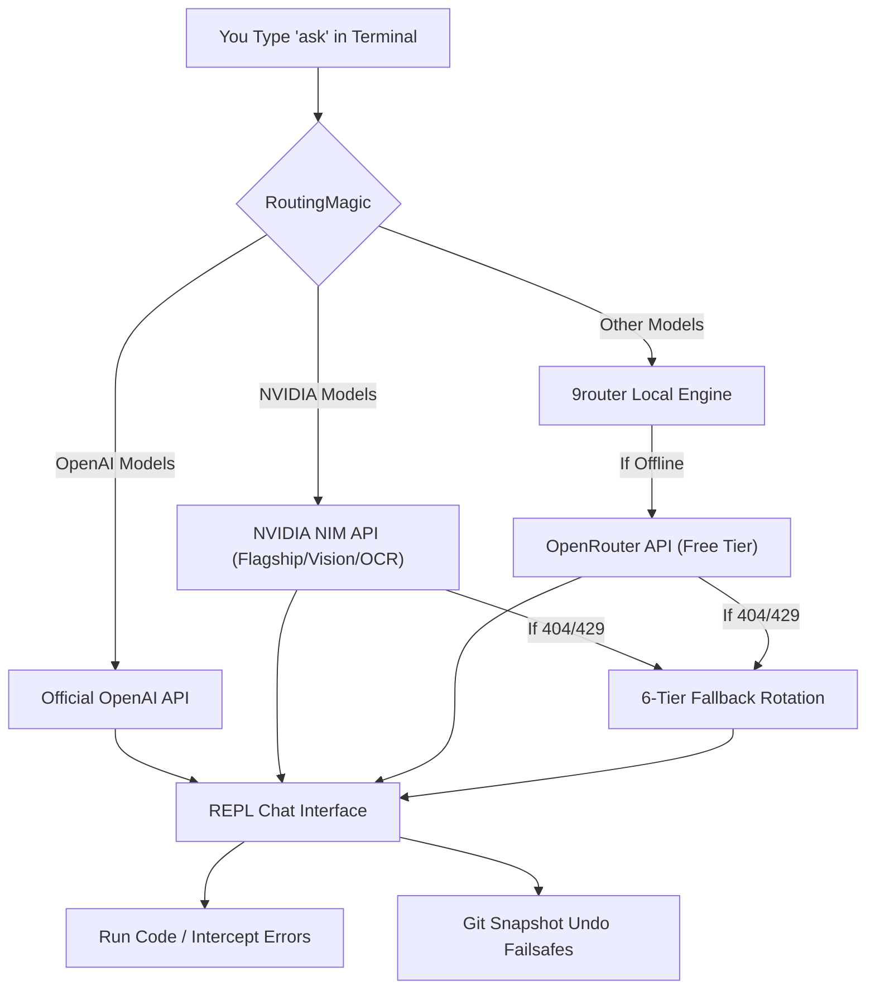

# RoutingMagic 🪄

**Your Heuristic AI Pair-Programmer & Codebase Router**

RoutingMagic is a terminal-based developer assistant designed to sit directly in your workspace. It sniffs project context, implements resilient model routing with automatic failovers, provides git-snapshot failsafes (undos), and supports multi-image analysis and multi-agent council deliberation—all without token bloat.

---

## 📖 The User Story

Imagine you're coding a complex application. Copy-pasting multiple files into a web-based AI chat is slow, and giving an autonomous agent full write access to your directory is risky if it writes broken code. 

**RoutingMagic** solves this. Running directly in your terminal, it automatically understands your current workspace and stack.
- Type `ask` to start a continuous, context-aware pair-programming session.
- If a paid model fails or gets rate-limited, RoutingMagic automatically rotates through a resilient fallback chain.
- If the AI writes broken code, a simple `/restore` command acts as an "Undo" button to revert your codebase.
- Need high-reasoning audits? A `/council` command spins up three distinct models to critique and synthesize the best solution.

---

## 🏗️ Architecture Flow



---

## 📦 Step-by-Step Installation

### Step 1: Install & Start 9router
RoutingMagic relies on **9router** to securely route requests locally.
1. Open your terminal.
2. Install and start 9router in the background (it binds to port `20128` by default).

### Step 2: Clone RoutingMagic
Clone the repository to your projects folder:
```bash
git clone https://github.com/prakharmishra2026/RoutingMagic.git ~/Projects/RoutingMagic
cd ~/Projects/RoutingMagic
```

### Step 3: Run the Installer
Register the global commands and aliases on your computer:
```bash
chmod +x install.sh
./install.sh
source ~/.zshrc
```

### Step 4: Add Your API Keys
Open `~/global.env` and populate your API credentials:
```env
NVAPI_KEY=your_nvidia_nim_api_key
OPENROUTER_API_KEY=your_openrouter_api_key
# Optional: Model-specific NVIDIA NIM keys
NVAPI_KEY_NEMOTRON_OCR=key_for_ocr
```

---

## 🚀 How to Use (CLI vs. Interactive REPL)

RoutingMagic operates in two main modes: **CLI One-Shot Mode** and **Interactive REPL Mode**.

### 1. Interactive REPL Mode (Most Powerful)
To use interactive features, slash commands, or maintain a conversation, **you must start the interactive REPL session first**.

Start the session by typing one of these commands in your terminal:
- `ask` — Start a standard REPL session (fast, context-aware).
- `ask deep` — Start a deep-context REPL session (scans project memory files: `memory.md`, `progress.md`, `scratchpad.md`, `lessons.md` to load full codebase context).

#### 🛠️ Slash Commands (Only inside the active `ask` REPL session)
Once you see the green `>>>` prompt, you are inside the REPL and can type these commands:

| Command | Action | Example |
| :--- | :--- | :--- |
| **`/council <prompt>`** | Launch 3-model multi-agent deliberation & synthesis | `/council critique this architecture` |
| **`/mc <prompt>`** | Alias for `/council` | `/mc refactor this logic` |
| **`/paste`** | Enter clipboard image pasting queue (Ctrl+V / Cmd+V) | `/paste compare these mockups` |
| **`/model`** | Dropdown menu to dynamically switch active LLM models | `/model` |
| **`/cost`** | View token cost tracking and daily RPM/budget limits | `/cost` |
| **`/safe`** | Take a silent git snapshot of the directory before AI writes code | `/safe` |
| **`/restore`** | Revert directory to the last snapshot taken with `/safe` (Undo) | `/restore` |
| **`/workspace <name>`** | Separate conversation context (e.g. `frontend`, `backend`) | `/workspace api` |
| **`/pin <file>`** | Lock a critical file into memory so the AI never forgets it | `/pin src/auth.ts` |
| **`/run <command>`** | Run a terminal command; if it errors, AI auto-corrects the code | `/run npm run build` |
| **`/test <command>`** | Run tests; if they fail, error logs are piped to the AI | `/test pytest` |
| **`exit` / `quit`** | Close the REPL session safely | `exit` |

---

### 2. CLI One-Shot Mode (Quick Terminal Commands)
Run these commands directly in your terminal shell without starting the REPL:

- **`ask "your question"`**
  Quickly asks a question about the directory you are in.
  *Example:* `ask "How do I start the server?"`
- **`ask deep "your question"`**
  Asks a question using the deep repository context.
  *Example:* `ask deep "Are there any security issues in our auth setup?"`
- **`ask council "your question"`** (or `mc "..."` / `MC "..."`)
  Delivers a high-reasoning, peer-critiqued and synthesized answer.
  *Example:* `ask council "Audit our database migration plan"`
- **`ask /paste [image_paths...] "your prompt"`**
  Analyze or compare images directly from files.
  *Example:* `ask /paste img1.png img2.png "Compare these charts"`
- **`save`**
  Generate a plain-English, color-coded summary of recent git changes, then update your project memory files (`memory.md`, `progress.md`, etc.). Use `save --auto` to skip confirmation.

---

## 🧠 June 2026 AntiGravity Model Stack

RoutingMagic uses zero-latency regex heuristics (`smart_route`) to direct your query to the specialized model best equipped for the task:

* **Deep Math & Finance** ➡️ `nvidia/nemotron-3-super-120b-a12b:free`
* **Long Document Planning** ➡️ `nemotron-3-super-120b` (1M Context)
* **Rapid Code Refactoring** ➡️ `qwen3-coder:free`
* **Agentic JSON Workflows** ➡️ `llama-3.3-70b-instruct:free`
* **Flagship Tool Orchestration** ➡️ `nemotron-super-49b` (NVIDIA NIM)
* **Stock Chart Vision** ➡️ `nemotron-nano-vl-8b` (NVIDIA NIM)
* **Financial Document Extraction** ➡️ `nemotron-ocr-v1` (NVIDIA NIM)
* **Multi-Agent Deliberation** ➡️ **LLM Council** (3 dynamic, query-tailored distinct models)

### Fallback Rotation
If OpenRouter limits are hit (429) or NIM endpoints fail, requests automatically fail over through a 6-tier rotation:
`Target Model -> Gemma 4 31B -> Nemotron 3 Super 120B -> GPT-OSS 120B -> Qwen3 Coder -> Llama 3.3 70B -> Gemini 2.5 Pro`

---

## 🛡️ Key Features In-Depth

### 1. Multi-Agent Council (`/council`)
Uses a 3-stage deliberation protocol to deliver premium, peer-reviewed solutions:
1. **Stage 1 (Opinions):** Queries exactly 3 distinct specialized free models in parallel (Coder, Reasoning, and General models resolved from the live OpenRouter registry).
2. **Stage 2 (Peer Review):** Anonymizes and swaps opinions, querying the 3 models in parallel to critique and score (1-10) each other.
3. **Stage 3 (Synthesis):** A paid reasoning Chairman (or `gemma-4-31b-it` if reasoning is not required) synthesizes the critiques into a single, high-fidelity final output.

### 2. Multi-Image Paste & Vision (`/paste`)
- Enforces a **10-image maximum** and **25MB cumulative base64 payload size** limit.
- **Explicit DONE Flow:** Paste images sequentially (Ctrl+V / Cmd+V). Hit Enter on a blank line to see the queue count. Type `done` or `/done` to proceed with your analysis prompt.
- **Session Cleanup:** Image paste queues are session-scoped and managed inside a temporary directory context manager (`SessionContext`), keeping your filesystem clean under any exit or exception.
